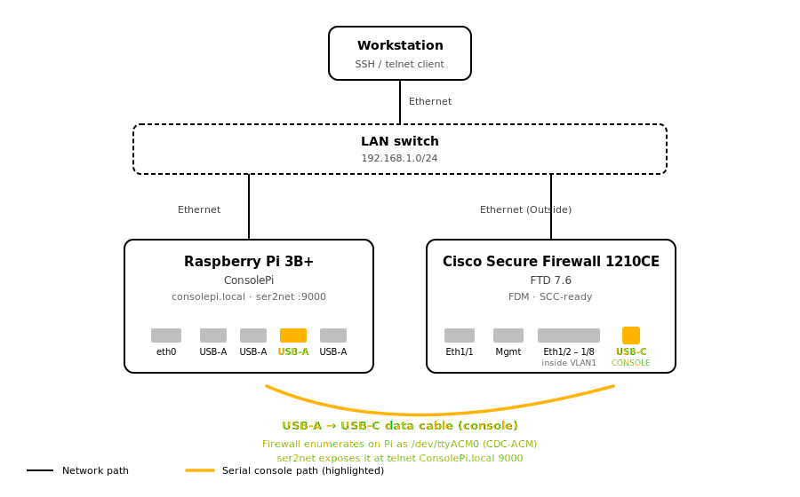

# Connect via USB-C (modern Cisco gear)

Cisco's newer platforms — the 1200/3100/4200 Secure Firewalls and
Catalyst 9000 switches — ship with a **USB-C console port** as a
first-class option alongside the traditional RJ45. The USB-C path is
strictly easier than RJ45 for one reason: **the target device itself
acts as the USB-serial converter**, so you don't need an FTDI or
Prolific chip in the cable.

{ .off-glb }

*Amber path = the USB console cable. Both devices are also attached to
the LAN via Ethernet, but the console data flows over the USB link, not
over the network.*

## What you need

- Any **USB-A to USB-C data cable** — the kind you'd use to charge a
  phone with data-transfer support. Any working USB-C data cable in
  your drawer probably works.
- **NOT a charge-only cable.** Some cheap USB-A→USB-C cables only pass
  power. If a cable makes your phone charge but doesn't let it appear
  as a device to your PC, it's charge-only. Won't work here.

## Physical connection

- USB-A end into any USB port on the Pi
- USB-C end into the target's USB-C console port (usually labeled with
  a "CONSOLE" screenprint)

## What the Pi sees

The target enumerates as a USB Communications Device Class (CDC-ACM)
device:

```bash
lsusb | grep -i cisco
# Bus 001 Device 005: ID 05a6:0009 Cisco Systems, Inc. Console
```

And a `/dev/ttyACM*` character device appears:

```bash
ls /dev/ttyACM*
# /dev/ttyACM0
```

Udev populates useful attributes:

```bash
udevadm info -q property /dev/ttyACM0 | grep -E '^ID_'
# ID_VENDOR=Cisco
# ID_MODEL=Cisco_USB_Console
# ID_MODEL_ID=0009
# ID_SERIAL=Cisco_Cisco_USB_Console
```

## ser2net port mapping

ConsolePi's ser2net config maps `/dev/ttyACM*` devices to telnet ports:

| Device | Telnet port |
|---|---|
| `/dev/ttyACM0` | 9000 |
| `/dev/ttyACM1` | 9001 |
| `/dev/ttyACM2` | 9002 |
| `/dev/ttyACM3` | 9003 |
| `/dev/ttyACM4` | 9004 |
| `/dev/ttyACM5` | 9005 |
| `/dev/ttyACM6` | 9006 |
| `/dev/ttyACM7` | 9007 |

(Traditional USB-serial adapters at `/dev/ttyUSB*` map to 8001-8008;
covered in **[Connect via RJ45](connect-cisco-rj45.md)**.)

## Talk to the device

From any host on your LAN:

```bash
telnet ConsolePi.local 9000
# or
telnet <pi-ip> 9000
```

Hit `Enter` to elicit a prompt from the target device.

Exit telnet: `Ctrl-]` then `quit`.

## Alternate: SSH + `screen` (direct)

If you'd rather bypass ser2net entirely (fewer moving parts, no telnet
required):

```bash
ssh pi@ConsolePi.local
sudo screen /dev/ttyACM0 9600
```

Exit `screen`: `Ctrl-A` then `k` to kill, or `Ctrl-A` then `d` to detach.

Baud rate on a USB-CDC device is largely nominal — the USB protocol
carries the data at native USB speeds — but conventionally we set it
to 9600 to match legacy expectations.

## Watch out for

- **RJ45 console and USB-C console can be plugged in simultaneously.**
  On Cisco boxes, **USB-C wins** when both are connected. If you plug
  in the USB-C cable and get no output, check whether the RJ45 side is
  actively holding the console; unplug it if so.
- **The `/dev/ttyACM0` number can change** if you plug and unplug
  multiple devices. If you're building persistent aliases, use the
  `by-id` path (`/dev/serial/by-id/usb-Cisco_Cisco_USB_Console-*`)
  instead of `/dev/ttyACM0`. `consolepi-addconsole` handles this for
  you.
- **The USB-C port doesn't deliver power to the cable.** The Pi's USB-A
  is the power source for the link.

## Multiple devices

The Pi 3B+ has 4 USB ports, so you can console 4 devices simultaneously
without a hub. `/dev/ttyACM0` through `/dev/ttyACM3` are usable at once,
each on its own telnet port (9000-9003).

If you need more, add a powered USB hub — but each additional device
adds a failure mode. Consider a second ConsolePi for a large fleet
(they auto-discover each other via mDNS).

## Next

- **[Access Methods](access-methods.md)** — telnet, SSH, `consolepi-menu`
- **[Troubleshooting](troubleshooting.md)** — if something isn't working
